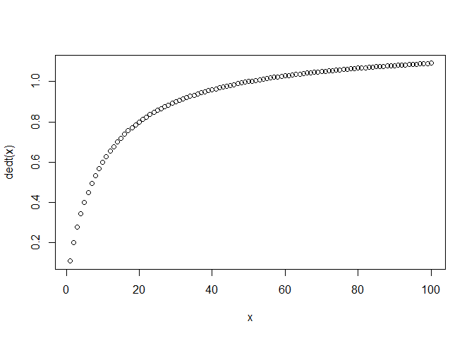
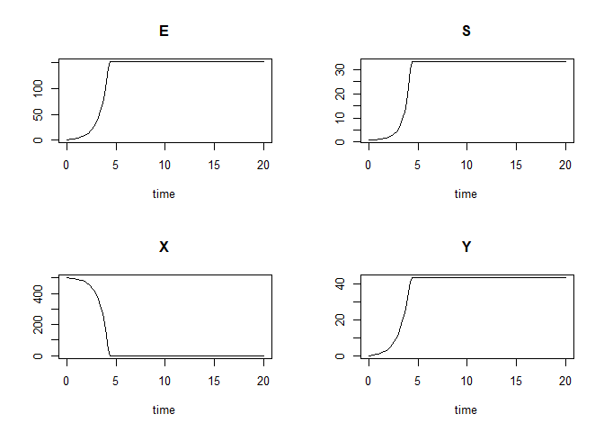
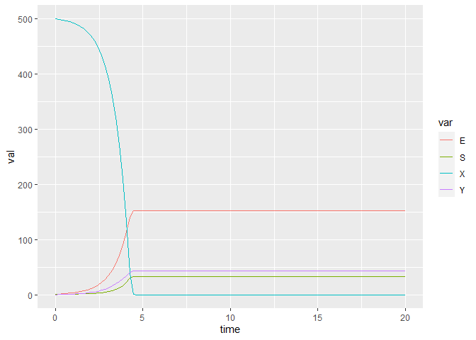
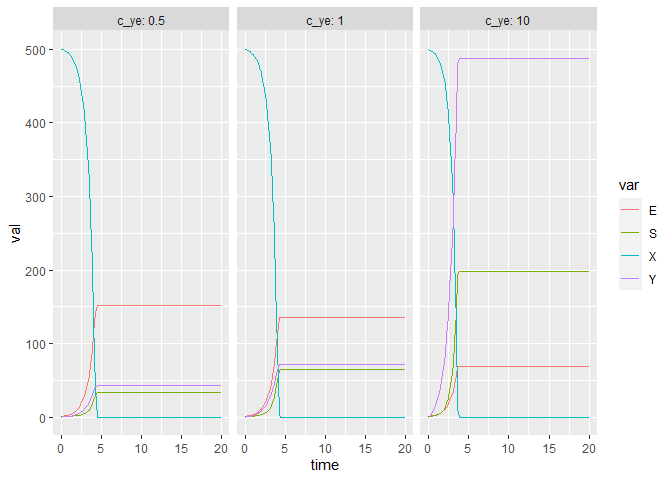

monod_model_with_deSolve
================
Chacon
2022-11-02

Very short document to show how to solve an ODE. It relies on the
deSolve package, so install that if you haven’t.

``` r
library(tidyverse)
```

    ## Warning in as.POSIXlt.POSIXct(Sys.time()): unable to identify current timezone 'E':
    ## please set environment variable 'TZ'

``` r
library(deSolve)
```

    ## Warning: package 'deSolve' was built under R version 4.2.2

We will solve a two-species facilitation model. Species “E” eats “X”
with max rate “v_xe” and half-saturation constant “k_xe”.

$$
\frac{dE}{dt} = E * v_{xe} * X / (X + k_{xe})
$$ We can see that the per-capita growth rate (dE/dt)/E increases in a
saturating way as X increases. Imaging v_xe = 1.2, and k_xe = 10:

``` r
dedt = function(x, v = 1.2, k = 10){
  v * x / (x + k)
}
x = 1:100
plot(x, dedt(x))
```

<!-- -->

As it grows, it also produces waste product “Y” proportional to growth
with proportion “c_ye”

$$
\frac{dY}{dt} = c_{ye} * E * v_{xe} * X / (X + k_{xe})
$$

Species “S” needs both X and Y to grow. It has a half-saturation
constant for both substrates, but only one max growth rate v_s. If
either X or Y is zero, there is no positive growth.

$$
\frac{dS}{dt} = S * v_{s} * X / (X + k_{xs}) * Y / (Y + k_{ys})
$$

Finally, food needs to go away. That’s easy, X goes away as E and S eat
it. Lets imagine E requires 2 units of X for one unit of growth (g_xe =
2), and S requires 1.5 units of X for one unit of growth (g_xs = 1.5)
(and also 1 unit of Y). Note that this equation is basically -(dE/dt
+dS/dt), multiplied by the growth efficiency parameters (g).

$$
\frac{dX}{dt} = - g_{xe} * E * v_{xe} * X / (X + k_{xe}) - g_{xs} * S * v_{s} * X / (X + k_{xs}) * Y / (Y + k_{ys})
$$

The equation for Y needs to be modified to remove it as S grows.

$$
\frac{dY}{dt} = c_{ye} * E * v_{xe} * X / (X + k_{xe}) - S * v_{s} * X / (X + k_{xs}) * Y / (Y + k_{ys})
$$

Altogether, there are four “state variables” (things that change): E, S,
X, Y

And there are eight “parameters” (things that don’t change): v_xe, k_xe,
c_ye, v_s, k_xs, k_ys, g_xe, g_xs

And four equations.

Parameters that don’t change go into a list, or a “named vector.”

``` r
parms = c(v_xe = 1.2, k_xe = 10, c_ye = 0.5,
          v_s = 1.8, k_xs = 10, k_ys = 5, g_xe = 3, g_xs = 1.5)
```

The state variables need to start with an “initial amount,” which I’ll
call y0:

``` r
y0 = c(E = 1, S = 1, X = 500, Y = 0)
```

We’re also going to need to specify how long to simulate, and the
intervals when we want the data. I’ll call this “times”

``` r
times = seq(from = 0, to = 20, length.out = 100) # saves 100 measurements
```

Finally, we need to put the equations into a function. If this seems
arcane to you, don’t worry about it and just accept it as magic for now.
The key things are:

1.  the function needs three arguments, which refer to time (t), the
    state variables (y), and the parameters (parms)
2.  at the end of it, the derivatives need to go in a list IN THE SAME
    ORDER AS IN YOUR Y0.
3.  The weird-looking with(as.list…) lets us use variable names. don’t
    worry too much about it

``` r
facilitation = function(t, y, parms){
  with(as.list(c(y,parms)),{
    dE = E * v_xe * X / (X + k_xe)
    dS = S * v_s * X / (X + k_xs) * Y / (Y + k_ys)
    dX = - g_xe * E * v_xe * X / (X + k_xe) - g_xs * S * v_s * X / (X + k_xs) * Y / (Y + k_ys)
    dY = c_ye * E * v_xe * X / (X + k_xe) -  S * v_s * X / (X + k_xs) * Y / (Y + k_ys)
    list(c(dE, dS, dX, dY))
  })
}
```

Finally, the “ode” function in desolve runs the simulation for us.

``` r
out = ode(y0, times, facilitation, parms)
```

It can plot directly:

``` r
plot(out)
```

<!-- -->

Or you can easily coerce it into a dataframe and plot with ggplot

``` r
out %>%
  data.frame() %>%
  pivot_longer(-time, names_to = "var", values_to = "val") %>%
  ggplot(aes(x = time, y = val, color = var))+
  geom_line()
```

<!-- -->

I will often do that in a loop, and change one parameter value at a
time, and save all the data in one big data.frame. Here, let’s try three
values of c_ye. Note that after each sim is run, it is converted to a
dataframe, then made into long-form (with pivot_longer), then the c_ye
value is added (with mutate), before row-binding the data to the
accumulating “results.”

Finally, we plot the same way as before, but facet for the different
values of c_ye. Note how higher Y production from E changes the amount
of Y present, and as a result, which species dominates.

``` r
c_yes = c(0.5, 1, 10)
results = data.frame()
for (curr_c_ye in c_yes){
  parms["c_ye"] = curr_c_ye
  this_result = ode(y0, times, facilitation, parms) %>%
      data.frame() %>%
      pivot_longer(-time, names_to = "var", values_to = "val") %>%
      mutate(c_ye = curr_c_ye)
  results = rbind(results, this_result)
}

results %>%
  ggplot(aes(x = time, y = val, color = var))+
  geom_line()+
  facet_wrap(~c_ye, labeller = label_both)
```

<!-- -->

Some notes:

1.  Sometimes, because this is a numerical solver, if numbers decline
    too rapidly, then can shoot below zero, causing odd consequences.
    Sometimes one can put in a check for this in the model function, to
    prevent the negative number from having off-target effects, like
    this:

``` r
facilitation = function(t, y, parms){
  with(as.list(c(y,parms)),{
    
    # here's a check for X, which often goes to zero:
    if (X < 0){
       X = 0
    }
    
    dE = E * v_xe * X / (X + k_xe)
    dS = S * v_s * X / (X + k_xs) * Y / (Y + k_ys)
    dX = - g_xe * E * v_xe * X / (X + k_xe) - g_xs * S * v_s * X / (X + k_xs) * Y / (Y + k_ys)
    dY = c_ye * E * v_xe * X / (X + k_xe) -  S * v_s * X / (X + k_xs) * Y / (Y + k_ys)
    list(c(dE, dS, dX, dY))
  })
}
```

2.  I used to mess with numerical solver tolerances (atol = absolute
    tolerance, rtol = relative tolerance), but I’ve stopped doing that,
    as I’ve found that errors that arise that are “fixed” with this
    approach usually are due to the model being not what one thought it
    was. I recommend only changing tolerances, or solvers, as a last
    resort.

3.  Similarly, if resources are only ever “available” or “in biomass”,
    then one can technically change the resource equations to algebraic
    equations. This sometimes helped with numerical instability, but
    again, I’ve since decided that it’s probably not the best solution,
    and probably you’ve set parameters to allow for too extreme of
    changes in time.
