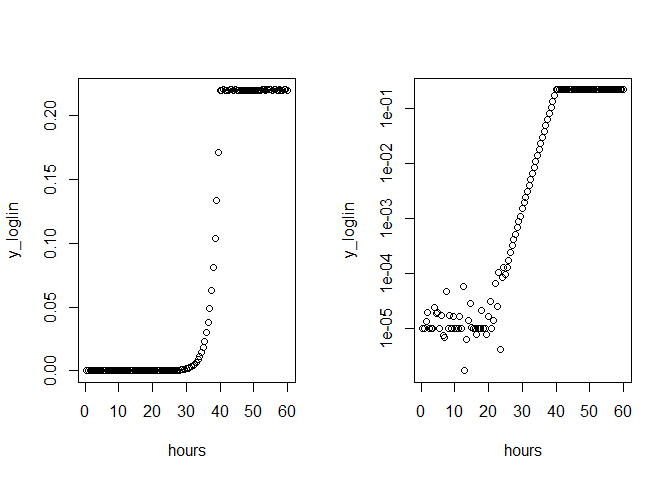
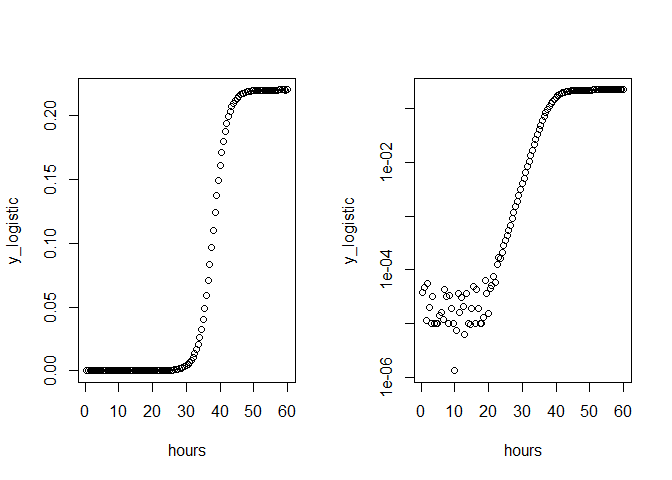
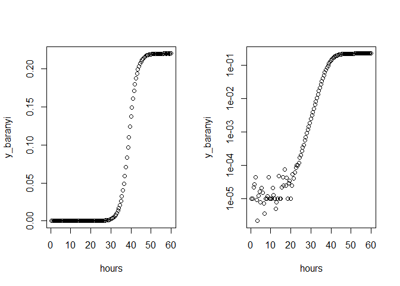
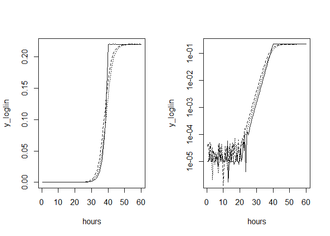
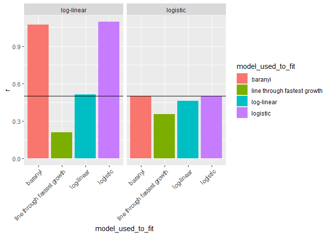

different growth models
================
Chacon
2022-11-07

This document shows the 3 different growth models which can be fit to
experimental data, e.g. from the TECAN.

It also shows how fitting models to data from one model doesn’t always
yield the expected growth rate, which means that choosing a valid model
is an important step.

There are three growth models available:

1.  log-linear model with lag time and saturation time.
2.  logistic growth
3.  Baranyi growth model (a variation on logistic growth)

## Log-linear growth model

This model has zero growth until time == “lag,” after which there is
exponential growth, which ceases completely once time == “end”. It takes
in a y0 (starting population) and grotwh rate (r, in /h) as the other
parameters. It is called log-linear because, due to the exponential
growth, the growth phase appears linear on a semi-log plot. Tony Dean
argues this is the most realistic for bacteria growing on rich media.

There also needs to be a time variable. For all of these data we’ll
simulate 60 hours.

We’ll make that data and add random noise to it, plot it on linear and
semi-log, and then we will retrieve the parameters by fitting. The
fit\_\[model\] functions have an optional argument “tries” which says
how many times to re-try fitting if it fails. By default this = 5,
though I will often increase it to 100 or 200.

``` r
hours = 1:120 / 2 # 30 minute time intervals
lag = 20 # when growth starts (hours)
end = 40 # when growth stops (hours)
y0 = 1.e-5 # starting pop size (OD, grams, etc.)
r = 0.5 # per-capita instantaneous growth rate (/hour)

y_loglin = log_linear(hours, r, y0, lag, end)
y_loglin = y_loglin + rnorm(length(hours), mean = 0, sd = 2.e-5) # added noise
y_loglin[y_loglin<0] = y0 # prevented any negative numbers
par(mfrow = c(1,2))
plot(hours, y_loglin)
plot(hours, y_loglin, log = "y")
```

<!-- -->

``` r
parms = fit_loglinear(hours, y_loglin)
print(parms)
```

    ##            r           y0          lag          end 
    ## 5.141354e-01 1.295398e-05 2.090111e+01 3.984785e+01

## Logistic growth.

This model also has four parameters. In addition to r and y0 (which have
the same meaning as in the log-linear model), this model has K (carrying
capacity, aka max value of y) and lag, but here lag means the time at
which growth is half-maximum.

Below I choose values to make the curve roughly overlap that from above.

``` r
K = 0.22
lag_logistic = 38
y_logistic = logistic(hours, r, lag_logistic, K, y0)
y_logistic = y_logistic + rnorm(length(hours), mean = 0, sd = 2.e-5) # added noise
y_logistic[y_logistic<0] = y0 # prevented any negative numbers
par(mfrow = c(1,2))
plot(hours, y_logistic)
plot(hours, y_logistic, log = "y")
```

<!-- -->

``` r
# fitting this type of data uses fit_logistic
parms = fit_logistic(hours, y_logistic, tries = 100)
print(parms)
```

    ##            r          lag            K           y0 
    ## 4.999931e-01 3.800023e+01 2.199997e-01 1.204442e-05

## Baranyi model

This curve looks very similar to that from a pure logistic. The main
difference is that lag is interpreted more similar to lag from the
log-linear model: roughly when growth starts. It also has a ymax which
is the same as K, y0, and r.

``` r
lag_baranyi = 19
y_baranyi = baranyi(hours, r, lag_baranyi, K, y0)
y_baranyi = y_baranyi + rnorm(length(hours), mean = 0, sd = 2.e-5) # added noise
y_baranyi[y_baranyi < 0] = y0
par(mfrow = c(1,2))
plot(hours, y_baranyi)
plot(hours, y_baranyi, log = "y")
```

<!-- -->

``` r
# fitting this type of data uses fit_baranyi
parms = fit_baranyi(hours, y_baranyi, tries = 100)
print(parms)
```

    ##            r          lag         ymax           y0 
    ## 4.999149e-01 1.092769e+01 2.199983e-01 1.770645e-07

## The log-linear model is quite different from the logistic and Baranyi models

Here I plot them over each other. While they all have the same max
growth rate (r), the log-linear sustains this for longer.

``` r
par(mfrow = c(1,2))
plot(hours, y_loglin, type = "l")
lines(hours, y_logistic, lty = 2)
lines(hours, y_baranyi, lty = 3)
plot(hours, y_loglin, type = "l", log = "y")
lines(hours, y_logistic, lty = 2)
lines(hours, y_baranyi, lty = 3)
```

<!-- -->

This means that fitting the different models to data produced by one
model can result in different growth rates. Here I fit to the loglin
data (left) and to the logistic data (right), with each different model.

I also include a fourth fitting procedure, “fit_loglinear_lm”, which
will never fail and simply fits a line to an arbitrary number of points
around the point where growth is increasing fastest.

The main thing to note (besides that sometimes even on generated data
fitting still fails), is that fitting a logistic-like model to
log-linear-like data tends to overestimate growth rate by a factor of 2,
while the reverse is not true. Take home: choose your model wisely!

``` r
rs_on_loglin = c(fit_loglinear(hours, y_loglin, 200)[1], fit_logistic(hours, y_loglin, 200)[1],
       fit_baranyi(hours, y_loglin, 200)[1], fit_loglinear_lm(hours, y_loglin, surround = 5))
rs_on_logistic = c(fit_loglinear(hours, y_logistic, 200)[1], fit_logistic(hours, y_logistic, 200)[1],
       fit_baranyi(hours, y_logistic, 200)[1], fit_loglinear_lm(hours, y_logistic, surround = 5))
data.frame(r = c(rs_on_loglin, rs_on_logistic),
           data_generating_model = rep(c("log-linear", "logistic"), each = 4),
           model_used_to_fit = rep(c("log-linear","logistic", "baranyi", "line through fastest growth"),2)) %>%
  ggplot(aes(x = model_used_to_fit, y = r, fill = model_used_to_fit))+
  geom_bar(stat = "identity")+
  geom_hline(yintercept = 0.5)+
  facet_wrap(~data_generating_model, ncol = 2)+
  theme(axis.text.x = element_text(angle = 45, hjust = 1))
```

<!-- -->
