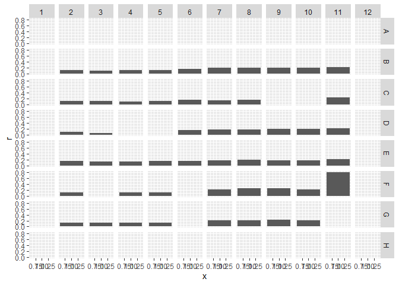
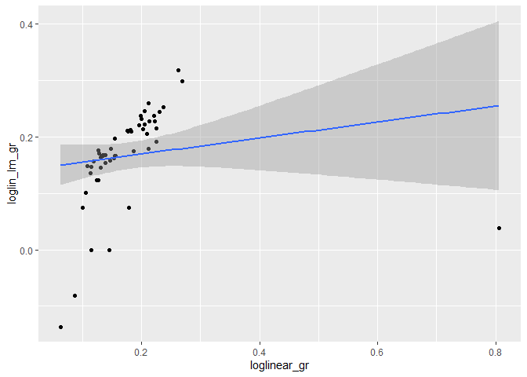

Tecan exploration and growth curve fitting
================
Chacon
2022-11-07

## Tecan data

This shows how to use some helper functions to read in TECAN data and
calculate growth rates. See the other .md, “different_growth_models.md,”
to better understand the different growth models one can use to fit.

Included here is OD data from a TECAN read. To get this, we save the OD
“chunk” of data from the xls that the TECAN generates. Open the .csv in
xcel if you wish to see what this file should look like.

Here is loading. Note that we specify that the response variable here is
“OD” (measure = “OD”). If we were also loading in CFP or other
fluorescence data, we’d want to change that argument.

The gist of read_tecan_csv is to get the data into long-format, which is
what we want for plotting and curve fitting.

``` r
OD_path = "./25oct16_OD.csv"
OD = read_tecan_csv(OD_path, sep = ",", measure = "OD")
head(OD)
```

    ## # A tibble: 6 × 6
    ##   cycle seconds  temp well      OD  hour
    ##   <dbl>   <dbl> <dbl> <fct>  <dbl> <dbl>
    ## 1     1       0  29.9 A1    0.0986     0
    ## 2     1       0  29.9 A2    0.0979     0
    ## 3     1       0  29.9 A3    0.0970     0
    ## 4     1       0  29.9 A4    0.0955     0
    ## 5     1       0  29.9 A5    0.0971     0
    ## 6     1       0  29.9 A6    0.0959     0

If we were loading multiple data sources (OD, CFP, YFP), we’d want to
merge them all together. To do this, we MUST remove the seconds, hour,
and temp from the subsequent data sources, as these are not an exact
match due to fluctuations between measurements. Below is an example of
how we’d do that, though it is faking having different data and actually
just reloading the same data twice.

``` r
OD_path = "./25oct16_OD.csv"
OD = read_tecan_csv(OD_path, sep = ",", measure = "OD")
fake_CFP_path = "./25oct16_OD.csv"
# notice how we select -hour, seconds, temp to remove these
CFP = read_tecan_csv(OD_path, sep = ",", measure = "CFP") %>%
  select(-c(hour, seconds, temp))
all_data = OD %>% left_join(CFP)
```

    ## Joining, by = c("cycle", "well")

``` r
head(all_data)
```

    ## # A tibble: 6 × 7
    ##   cycle seconds  temp well      OD  hour    CFP
    ##   <dbl>   <dbl> <dbl> <fct>  <dbl> <dbl>  <dbl>
    ## 1     1       0  29.9 A1    0.0986     0 0.0986
    ## 2     1       0  29.9 A2    0.0979     0 0.0979
    ## 3     1       0  29.9 A3    0.0970     0 0.0970
    ## 4     1       0  29.9 A4    0.0955     0 0.0955
    ## 5     1       0  29.9 A5    0.0971     0 0.0971
    ## 6     1       0  29.9 A6    0.0959     0 0.0959

## Plotting

I included a couple of helper functions to plot the plate in the same
shape as the actual plate. It returns the ggplot object, so you can
style it however you wish after the fact.

``` r
fig = plot_plate(OD, "OD")
fig
```

<!-- -->

``` r
fig + theme_bw(12) + scale_y_log10() + labs(title = "semi-log plot")
```

<!-- -->

## metadata

Previously I had a function which would read a plate-shaped .csv and use
this to add metadata (e.g. treatments). I’ve since realized that I can’t
predict everyone’s usage, so instead here I’ll show the most general
(albeit cumbersome) way to add metadata. Then, I use plot_plate with a
color argument to plot the metadata.

``` r
# note: these aren't the actual treatments from that plate, its just a demo
OD$media = "water" # everything not specified gets this treatment
OD$media[OD$well %in% c("B2","B3","B4","B5")] = "succinate"
OD$media[OD$well %in% c("C7","C8","C9","C10")] = "glucose"

# then we can plot the treatment colors too
plot_plate(OD, measure = "OD", color = "media") + scale_y_log10()
```

<!-- -->

## Subtracting blanks is critical

One of the main things people wish to do is measure growth rates. See
the other .md for a better understanding of the different growth
functions.

Critically, one needs to have the data start at a reasonable y-value,
because almost all of the fitting functions depend on a reasonably y0
from which exponential (or logistic) growth can progress.

Ideally, one would subtract a blank, and then what is left is “correct.”
However, due to lower-limits on the TECAN’s measurement ability, this
may prove erroneous as well.

Here I do a compromise. I subtract the minimum value from each well.
Then, under the assumption that we started with OD = 0.5 / 200 (i.e. an
OD = 0.5 stock diluted 1/200), we set any value that is below that to
that.

``` r
OD = OD %>% group_by(well) %>% 
  mutate(OD = OD - min(OD)) %>%
  mutate(OD = ifelse(OD <= 0.5/200, 0.5/200, OD)) %>%
  ungroup()

plot_plate(OD)+labs(title = "y starts around 0.5 / 200")
```

<!-- -->

## Measuring growth rates.

For each of the growth-curve-fitting functions, there is an associated
“fit_all\_\[\]” function which applies it to a whole plate.

Please note that non-linear curve fitting sometimes fails to converge.
To remedy this, try increasing “tries,” or smoothing your data (an
example data smoothing is below).

Here I show how to do all four functions. They return a data frame which
has as many rows as \# of wells \* \# of parameters in model. I.e. it
loses the temporal data. They can be merged together after the fact,
however.

There is also a function “plot_plate_growthrates” which plots the growth
rates in the shape of the plate. I use it for one set of growth rates
below.

You’ll see that some wells are missing data–that is because
curve-fitting failed on those wells.

``` r
loglin_gr = fit_all_loglinear(OD, measure = "OD", tries = 50)
```

    ## `summarise()` has grouped output by 'well'. You can override using the
    ## `.groups` argument.

``` r
logistic_gr = fit_all_logistic(OD, measure = "OD", tries = 50)
```

    ## `summarise()` has grouped output by 'well'. You can override using the
    ## `.groups` argument.

``` r
baranyi_gr = fit_all_baranyi(OD, measure = "OD", tries = 50)
```

    ## Warning in log(1 + (exp(r * At) - 1)/exp(logymax - logy0)): NaNs produced

    ## Warning in log(1 + (exp(r * At) - 1)/exp(logymax - logy0)): NaNs produced

    ## `summarise()` has grouped output by 'well'. You can override using the
    ## `.groups` argument.

``` r
loglin_lm_gr = fit_all_loglinear_lm(OD, measure = "OD", surround = 5)

plot_plate_growthrates(loglin_gr, response = "r")
```

    ## Warning: Removed 45 rows containing missing values (position_stack).

<!-- -->

As shown in the other .md, these models don’t always yield identical
growth rates. That said, they do correlate:

``` r
loglin_gr %>%
  mutate(loglinear_gr = r) %>%
  select(well, loglinear_gr) %>%
  left_join(baranyi_gr %>%
              mutate(baranyi_gr = r) %>%
              select(well, baranyi_gr)) %>%
  ggplot(aes(x = loglinear_gr, y = baranyi_gr))+
  geom_point()+
  stat_smooth(method = "lm")+
  ylim(0,1)+
  xlim(0,0.4)
```

    ## Joining, by = "well"
    ## `geom_smooth()` using formula 'y ~ x'

    ## Warning: Removed 45 rows containing non-finite values (stat_smooth).

    ## Warning: Removed 45 rows containing missing values (geom_point).

<!-- -->

``` r
loglin_gr %>%
  mutate(loglinear_gr = r) %>%
  select(well, loglinear_gr) %>%
  left_join(loglin_lm_gr %>%
              mutate(loglin_lm_gr = r) %>%
              select(well, loglin_lm_gr)) %>%
  ggplot(aes(x = loglinear_gr, y = loglin_lm_gr))+
  geom_point()+
  stat_smooth(method = "lm")
```

    ## Joining, by = "well"
    ## `geom_smooth()` using formula 'y ~ x'

    ## Warning: Removed 45 rows containing non-finite values (stat_smooth).
    ## Removed 45 rows containing missing values (geom_point).

<!-- -->

Two things you could do to help with fitting are smoothing the data.
Another common thing is to cap the data at the max value reached.

``` r
# smooth data with a median smoothing, window size 11
OD = OD %>%
  group_by(well) %>%
  arrange(hour) %>%
  mutate(OD_smooth = rollmedian(OD, 11, fill = NA))

# cap data at the maximum reached
OD = OD %>%
  group_by(well) %>%
  mutate(OD_capped = ifelse(cycle > cycle[OD == max(OD)][1], max(OD), OD))

plot_plate(OD, measure = "OD_smooth")+labs(title = "smoothed OD")
```

    ## Warning: Removed 10 row(s) containing missing values (geom_path).

<!-- -->

``` r
plot_plate(OD, measure = "OD_capped")+labs(title = "capped OD")
```

<!-- -->

Finally, let’s redo growth rates on the capped data, and then plot the
predicted lines over this. We can do this for each curve-fitting model
(but not the loglineaer_lm model, because that works differently). Here
we’ll do it just for loglinear and logistic.

To plot predicted lines, we join the original data with the growth rate
dataframe, add a new column called “OD_pred” which is the fitted line,
then use plot plate, and finally add the second set of information.

Note that making the OD_pred depends on using the growth model, which
means we need to specify differently-named parameters for each curve.

``` r
loglin_gr = fit_all_loglinear(OD, measure = "OD_capped", tries = 50)
```

    ## `summarise()` has grouped output by 'well'. You can override using the
    ## `.groups` argument.

``` r
logistic_gr = fit_all_logistic(OD, measure = "OD_capped", tries = 50)
```

    ## `summarise()` has grouped output by 'well'. You can override using the
    ## `.groups` argument.

``` r
left_join(OD, loglin_gr) %>%
  rowwise() %>%
  mutate(OD_pred = log_linear(hour, r, y0,start, end)) %>%
  ungroup %>%
  plot_plate(measure = "OD_pred")+ # here is plot plate
  geom_line(aes(y = OD), size = 2, color = "black")+
  geom_line(size = 1, color = "blue")+
  scale_y_log10()
```

    ## Joining, by = "well"

    ## Warning: Transformation introduced infinite values in continuous y-axis
    ## Transformation introduced infinite values in continuous y-axis

<!-- -->

``` r
left_join(OD, logistic_gr) %>%
  rowwise() %>%
  mutate(OD_pred = logistic(hour, r, lag,K, y0)) %>%
  ungroup %>%
  plot_plate(measure = "OD_pred")+ # here is plot plate
  geom_line(aes(y = OD), size = 2, color = "black")+
  geom_line(size = 1, color = "blue")+
  scale_y_log10()
```

    ## Joining, by = "well"

    ## Warning: Removed 5954 row(s) containing missing values (geom_path).

    ## Warning: Removed 5954 row(s) containing missing values (geom_path).

<!-- -->
