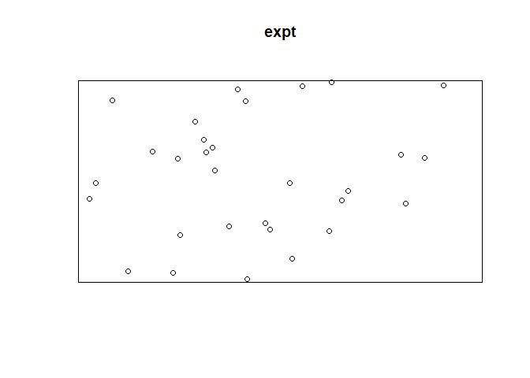
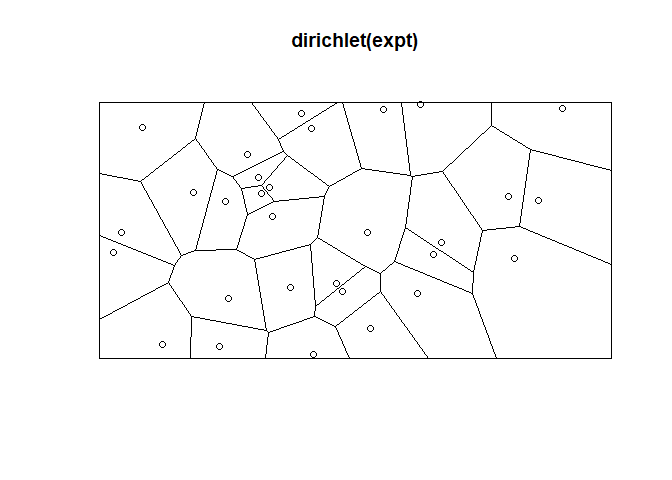
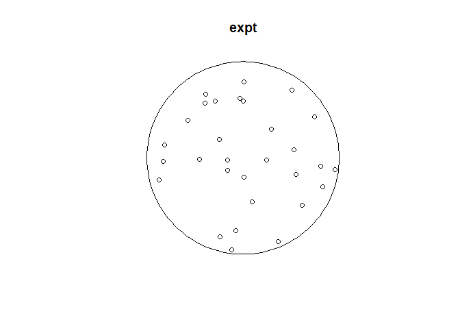
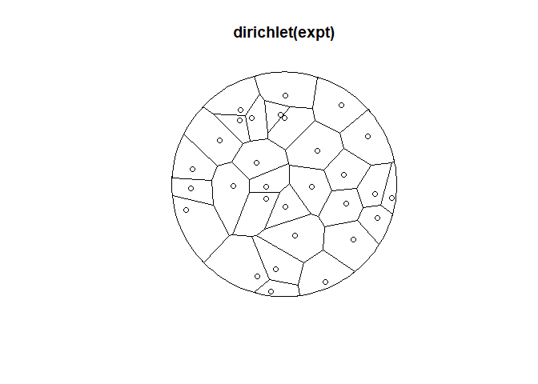
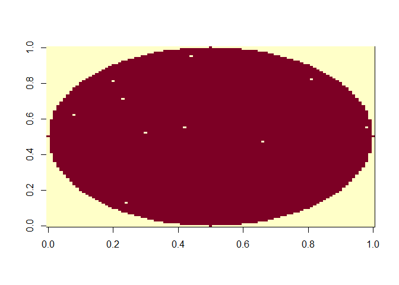
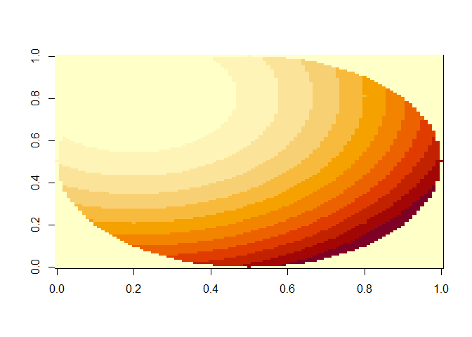
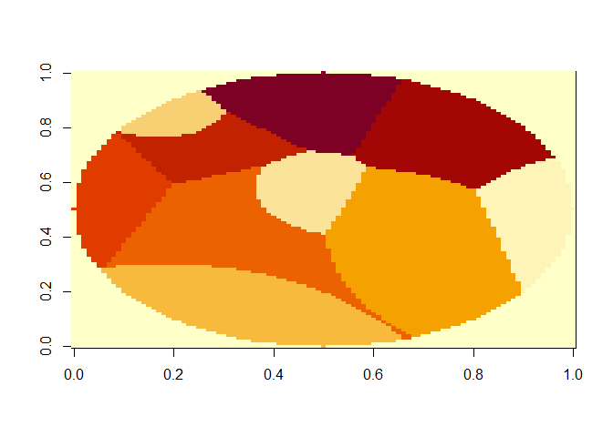
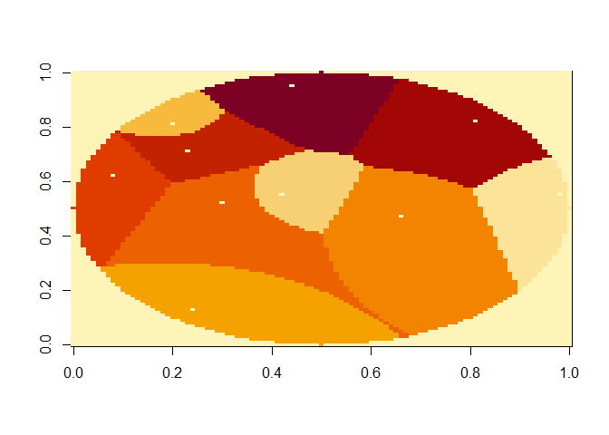

voronoi diagrams
================
Chacon
2022-11-07

To construct regular Voronoi diagrams and find their areas, we use
‘spatstat’ and one of its dependencies ‘deldir’.

``` r
rm(list = ls())
library(tidyverse)
```

    ## Warning in as.POSIXlt.POSIXct(Sys.time()): unable to identify current timezone 'E':
    ## please set environment variable 'TZ'

    ## ── Attaching packages ─────────────────────────────────────── tidyverse 1.3.2 ──
    ## ✔ ggplot2 3.3.6      ✔ purrr   0.3.5 
    ## ✔ tibble  3.1.8      ✔ dplyr   1.0.10
    ## ✔ tidyr   1.2.1      ✔ stringr 1.4.1 
    ## ✔ readr   2.1.3      ✔ forcats 0.5.2 
    ## ── Conflicts ────────────────────────────────────────── tidyverse_conflicts() ──
    ## ✖ dplyr::filter() masks stats::filter()
    ## ✖ dplyr::lag()    masks stats::lag()

``` r
library(spatstat)
```

    ## Warning: package 'spatstat' was built under R version 4.2.2

    ## Loading required package: spatstat.data

    ## Warning: package 'spatstat.data' was built under R version 4.2.2

    ## Loading required package: spatstat.geom

    ## Warning: package 'spatstat.geom' was built under R version 4.2.2

    ## spatstat.geom 3.0-3
    ## Loading required package: spatstat.random

    ## Warning: package 'spatstat.random' was built under R version 4.2.2

    ## spatstat.random 3.0-1
    ## Loading required package: spatstat.core

    ## Warning: package 'spatstat.core' was built under R version 4.2.2

    ## Loading required package: nlme
    ## 
    ## Attaching package: 'nlme'
    ## 
    ## The following object is masked from 'package:dplyr':
    ## 
    ##     collapse
    ## 
    ## Loading required package: rpart
    ## spatstat.core 2.4-4
    ## Loading required package: spatstat.linnet

    ## Warning: package 'spatstat.linnet' was built under R version 4.2.2

    ## spatstat.linnet 2.3-2
    ## 
    ## spatstat 2.3-4       (nickname: 'Watch this space') 
    ## For an introduction to spatstat, type 'beginner'

First lets just do it in a rectangle called “arena”. We identify the
width and height of the rectangle in an “owin.” Then we simulate some
points. Then we make a “point process” object (ppp). These have their
own plotting function.

``` r
width = 8 # cm
height = 4
arena = owin(xrange = c(0, width), yrange = c(0, height))

n = 30
x = runif(n, 0, width)
y = runif(n, 0, height)

expt = ppp(x, y, window = arena)
plot(expt)
```

<!-- -->

We can quickly get and plot the raw Voronoi areas.

``` r
plot(dirichlet(expt))
points(x,y)
```

<!-- -->

``` r
voronoi = dirichletAreas(expt)
data.frame(x = x, y = y, voronoi = voronoi) %>%
  head()
```

    ##          x         y  voronoi
    ## 1 5.354147 1.8113106 1.113320
    ## 2 1.879786 0.1917609 0.652438
    ## 3 1.471290 2.5888977 1.206366
    ## 4 6.392905 2.5333539 1.448842
    ## 5 3.167123 3.8208452 0.385537
    ## 6 3.313880 3.5846691 0.978791

Presumably petri dishes will sometimes be used, and so you’ll want to
use a round arena rather than a rectangular one. For this, we can use
the “disc” function from spatstat. You can also make ellipses, estimate
an area from points, use a polygon, click to draw a polygon, etc. with
various spatstat functions. Try ?owin or ?spatstat.geom

``` r
radius = 3
n = 30
arena = disc(radius = radius, centre = c(radius, radius))
x = c()
y = c()
# probably a better way to simulate points, but this works
while(length(x) < n){
  x_temp = runif(1, 0, radius*2)
  y_temp = runif(1, 0, radius*2)
  dist2_from_center = (x_temp-radius)^2 + (y_temp - radius)^2
  if (dist2_from_center <= (radius^2)){
    x = c(x, x_temp)
    y = c(y, y_temp)
  }
}
expt = ppp(x, y, arena)
plot(expt)
```

<!-- -->

``` r
plot(dirichlet(expt))
points(x,y)
```

<!-- -->

``` r
data.frame(x, y, voronoi = dirichletAreas(expt)) %>%
  head()
```

    ##          x        y   voronoi
    ## 1 5.222056 4.277319 1.2902763
    ## 2 3.017937 2.402909 0.6951506
    ## 3 4.528442 5.109468 1.3270518
    ## 4 5.423459 2.743644 0.7110152
    ## 5 5.485672 2.096078 0.5781766
    ## 6 5.862145 2.637500 0.3421822

Note that there is now a package ‘ggvoronoi’ which can be used to plot
these prettily.

## Weighted Voronoi

Sometimes you may wish to calculate a weighted Voronoi diagram. This is
trickier, but can be done by creating raster images and calculating
distances from the x,y to each location, then multiplying these
distances by the weights. I’ve made some helper functions for this in
analysis_helper_functions.r.

For these functions to work, we need to start by making a mask, which is
basically a matrix of TRUE or FALSE that define the experimental area.
An important consideration is that this is thinking in “pixels,” so
everything must be an integer. If you are working with continuous
values, consider multiplying them by something and rounding so you end
up with an experimental area of roughly 200x200. Much smaller than this
and the diagrams get too noisy; much larger and it takes a LONG time to
process.

Here we’ll go right ahead and make a round mask. A rectangular one is
also easy to make.

``` r
source("./analysis_helper_functions.r")

radius = 50
center = radius + 1
# first we'll simulate x,y points. Since these must be integers, we'll use sample
n = 10
x = c()
y = c()
# probably a better way to simulate points, but this works
while(length(x) < n){
  x_temp = sample(1:(radius*2), 1)
  y_temp = sample(1:(radius*2), 1)
  dist2_from_center = (x_temp-center)^2 + (y_temp - center)^2
  if (dist2_from_center <= (radius^2)){
    x = c(x, x_temp)
    y = c(y, y_temp)
  }
}

mask = make_round_mask(radius)
image(mask)
```

<!-- -->

``` r
expt_start = mask * 1
for (i in 1:length(x)){
  expt_start[x[i], y[i]] = 0
}
image(expt_start)
```

<!-- -->

We can calculate a distance array from our x,y points and the mask.

``` r
dist_array = get_squared_distance_array(x, y, mask)
#this is what one looks like:
image(dist_array[3,,])
```

<!-- -->

Let’s make fake weights. The first 10 will get no weight (weight of 1),
and the second 10 will get a weight of 2.

The higher-weighted stuff should “pull more points,” so the actual
weighting divides distances by the weigth.

``` r
weights = rep(c(1,2), each = n/2)
weighted_dists = apply_weight(dist_array, weights)
closest_map = get_closest_map(weighted_dists, mask)
image(closest_map)
```

<!-- -->

``` r
closest_map_with_points = closest_map
for (i in 1:length(x)){
  closest_map_with_points[x[i], y[i]] = -1
}
image(closest_map_with_points)
```

<!-- -->

Finally you can get areas simply, and use them later:

``` r
data.frame(x, y, weighted_voronoi = get_areas(closest_map, n)) %>%
  head()
```

    ##    x  y weighted_voronoi
    ## 1 99 56              583
    ## 2 43 56              466
    ## 3 21 82              209
    ## 4 25 14             1050
    ## 5 67 48             1654
    ## 6 31 53             1140
